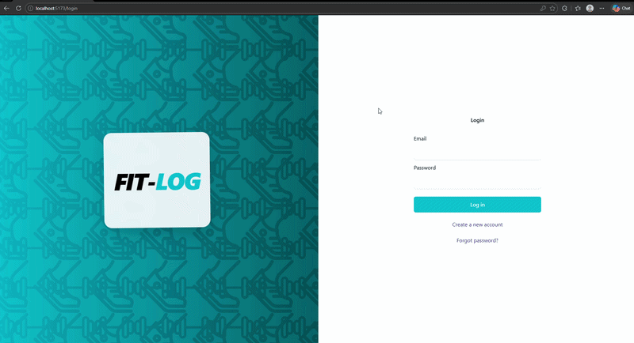
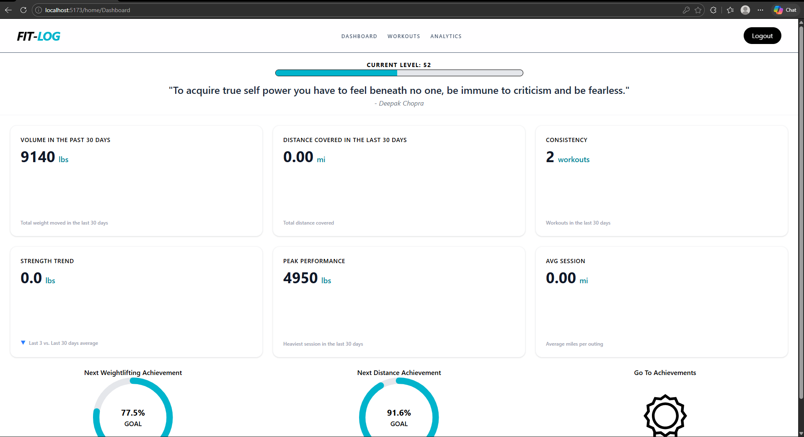
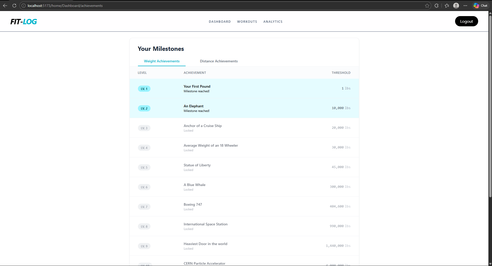
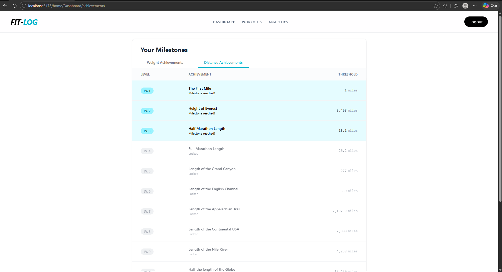
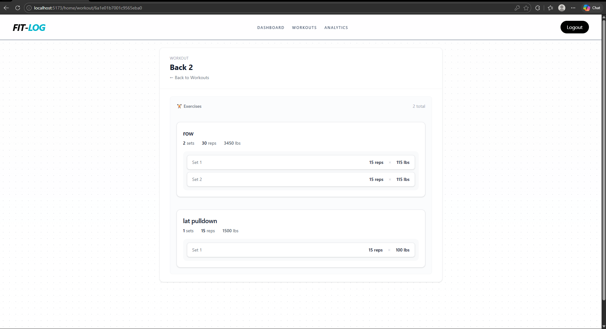
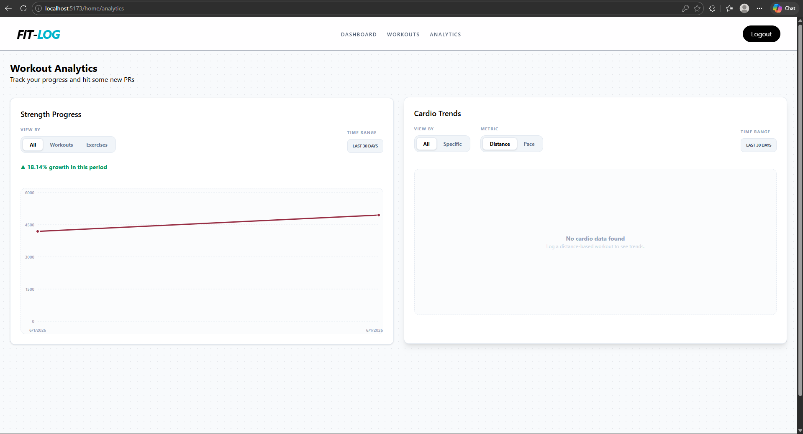

# Fit Log

A web app to track workouts, analyze progress, and visualize fitness data.

## Features
- Login/ register
- create, update, and delete workouts
- acheivments 
- analytics for workouts

### Planned
- add more styling for a modern look
- Find somewhere to host

## Tech Stack
- React 
- Tailwind CSS
- Appwrite (backend)